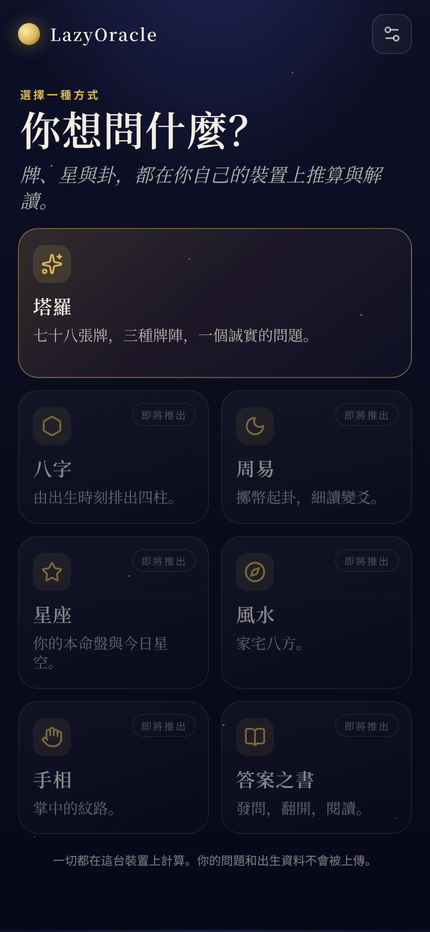
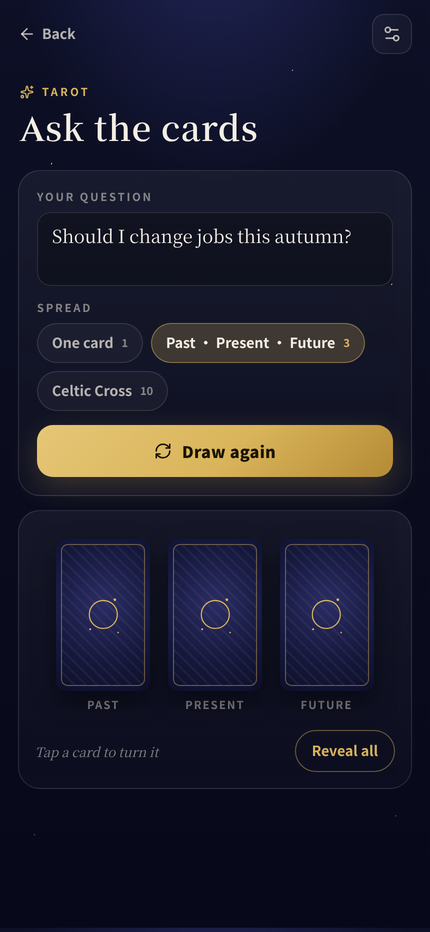

# LazyOracle

**A beautiful, fully on-device fortune-telling companion: Tarot, BaZi (四柱八字), I Ching (周易), Western astrology (星座), Feng Shui (风水), palmistry (手相) and the Book of Answers.**

Deterministic engines do the calculating. A small local language model (Qwen3-class, 4-bit, running on the phone) does the explaining. Nothing about your birth data or questions leaves the device unless you explicitly point the app at your own LazyEdge-connected workstation.

Status: milestone 1 (Tarot on the PWA) is done; see the progress log in `docs/brief.md`.

<p align="center">  </p>

```bash
npm install
npm run dev        # PWA at http://localhost:5173
npm run check      # lint, tests, production build
```

To get narrative readings on the desktop, open Settings, enable the endpoint and point it at a local Ollama (`http://127.0.0.1:11434/v1`, model `qwen3:4b-q4_K_M`) or your LazyEdge workstation route. Sibling of [L & N](https://github.com/lachlanchen/L-And-N), which supplies the app shell and the publishing pipeline.

Price: US$0.99 (CNY 8 / HKD 8) on the App Store and Google Play; the PWA is free.

[TestFlight public beta](https://testflight.apple.com/join/JZJM3PFb) · [Google Play internal test](https://play.google.com/apps/internaltest/4701677916092886102) · [Web app](https://oracle.lazying.art) · [Android APK build 1](https://oracle.lazying.art/downloads/LazyOracle-1.0.0-build1.apk) · App Store and Google Play listings: in review.
