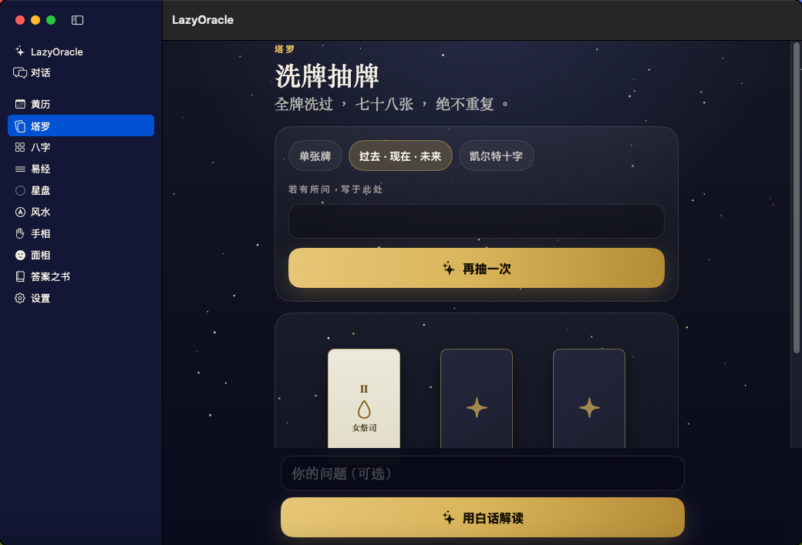
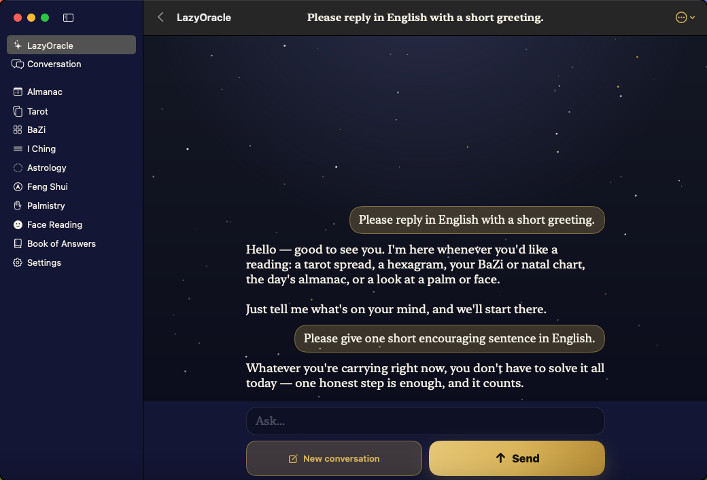

# Native LazyOracle for macOS

The Mac app uses the same SwiftUI practice screens, chat, saved readings,
translations, prompts, Swift models and JavaScriptCore rules as iOS. There is
one maintained Apple UI implementation. Desktop-specific code supplies a
sidebar, a resizable single window, Command-N for a new conversation,
Command-Return to send, AppKit camera preview and Mac camera selection.

Requires macOS 14 or newer. The test package contains Intel and Apple Silicon
executables. Runtime verification so far is on Intel macOS 15; Apple Silicon
has been compiled, not tested on hardware.

## Camera implementation

AVFoundation captures local frames and AppKit draws the live preview; SwiftUI
draws the landmarks. The iOS MediaPipe binary is not a macOS binary, so the
desktop adapter runs the existing MediaPipe Wasm package in an invisible,
nonpersistent WKWebView. This view only computes landmarks. It does not draw
the app interface or load a website.

The same face/hand model files are bundled locally. A private URL scheme serves
only bundled assets, and a content security policy blocks remote resources.
No HTTP listener, Python environment, model download or server camera upload
is required. Frames remain in memory. Only derived reading facts reach Tianji
when the reader requests an explanation.

The camera queue accepts at most ten frames per second and keeps only one
inference in flight. Native capture, geometry checks, burst stability and
saved-result interpretation use the existing contracts. Detection has a
20-second deadline and errors release its model and camera. WebView teardown
is deferred until its JavaScript callback unwinds. Removing a view during a
pending inference invalidates the generation so an old frame cannot become a
new capture.

The Wasm image path needs a working WebGL implementation even with CPU model
inference. An unaccelerated VM can run all other practices; it does not prove
camera support. A Mac without a compass still computes the eight sectors and
explains that a live facing is unavailable.

## Build

From the Linux workstation, using the existing KVM route:

```sh
bash tools/macos-sync.sh
ssh echomind-kvm-macos 'cd ~/Projects/LazyOracleDesktop && bash tools/macos-build.sh'
```

This sync updates only the isolated desktop workspace. It does not replace
the native iOS release workspace or the classic Auspice workspace. The build
produces `release/LazyOracle-macOS-1.0.0-1.zip` and checks its signature and two
architectures. This is an **ad-hoc signed development package**, not a notarized
download or Mac App Store release.

For a normal Mac checkout, prepare the shared prompts, strings and engine
resources as in `macos-sync.sh`, then run `tools/macos-build.sh`. The committed
Xcode project references `native/ios/Auspice` directly. If Swift files are
added, regenerate its file references with `ruby tools/macos-project.rb`
(the build host already has the `xcodeproj` gem). `tools/macos-icons.py`
recreates Mac icon sizes from the owned LazyOracle icon; it needs Pillow.

## Validation on 2026-09-25

| Host | Result |
| --- | --- |
| KVM Mac, macOS 15.7.9 / Xcode 26.3 | Universal build; native UI test for tarot with an empty question, I Ching, saved state after navigation/relaunch, live Tianji chat, home-to-chat sending and Chinese UI; production Swift/JSCore contracts |
| 7050/iMac via LazyTunnel, macOS 15.7.7 / Intel HD 530 | 72 offline model detections, six complete model lifecycles, stable repeated landmarks, face and palm engine results and Codable save/load round trips |
| 3040 via LazyTunnel, macOS 12.7.6 | Engine contracts pass. OS is below the UI minimum; its older WebKit also rejects the current vision Wasm. No full-app support is claimed |

The engine contract suite covers all 78 tarot cards in 300 draws, 100 I Ching
casts, BaZi, astrology, almanac, Feng Shui, books and migration of old face
results. The shared 138-test suite and lint pass. Keyboard sending and repeated no-camera navigation also pass. The iOS simulator build passes
after the platform adaptations.

No camera was enumerated on the two macOS 15 hosts. Recorded-image inference
is verified; physical webcam preview, permission recovery, camera switching
and live repeatability still need a camera-equipped Mac. Existing iOS and
Android test releases and their production reviews are unchanged.

MediaPipe Tasks is distributed by Google under Apache-2.0; its package version
is pinned by `package-lock.json`. The shared rules retain their existing
dependency licenses. See the [MediaPipe project](https://github.com/google-ai-edge/mediapipe)
and [native architecture](../native/README.md).

## Native interface evidence




