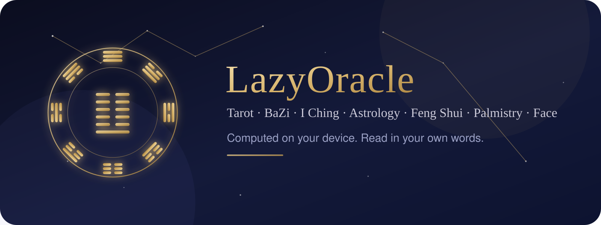
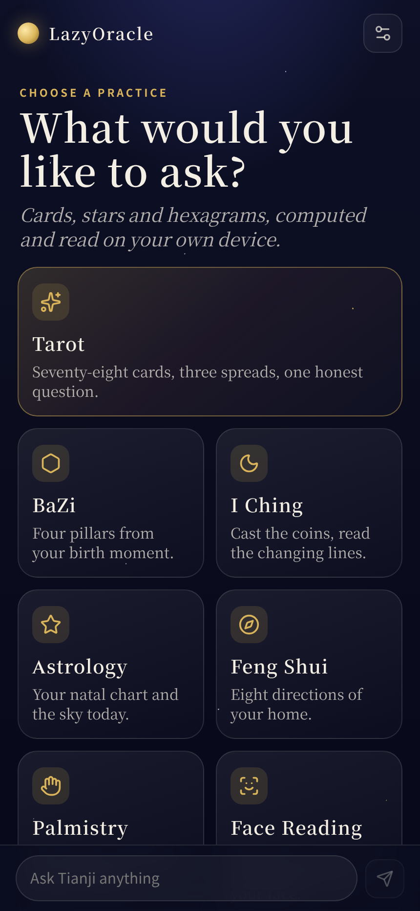
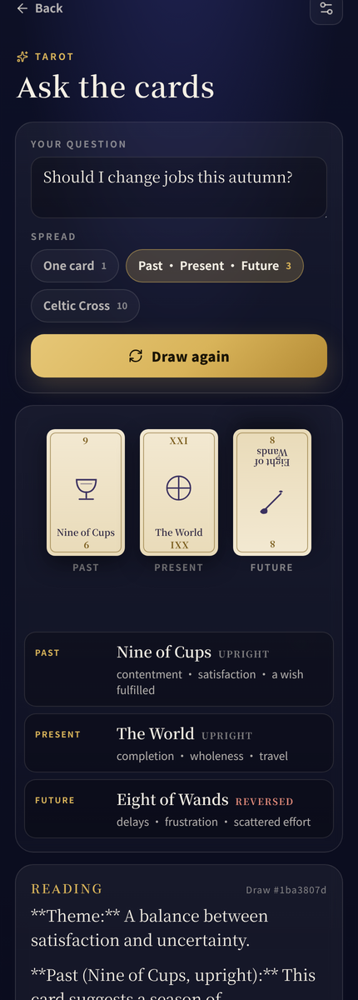
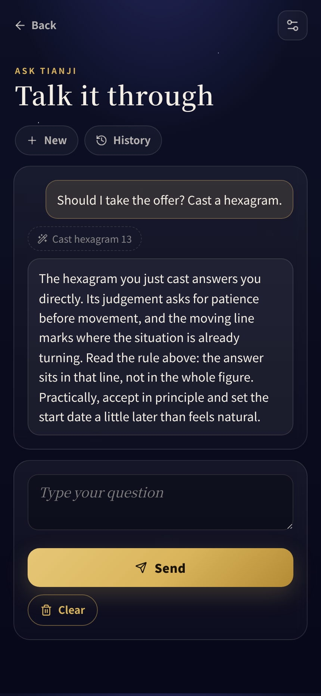

[English](../README.md) · [العربية](README.ar.md) · [Español](README.es.md) · [Français](README.fr.md) · [日本語](README.ja.md) · [한국어](README.ko.md) · [Tiếng Việt](README.vi.md) · [中文 (简体)](README.zh-Hans.md) · [中文（繁體）](README.zh-Hant.md) · [Deutsch](README.de.md) · [Русский](README.ru.md)

[](https://lazying.art)



# LazyOracle

**Восемь гадательных практик, вычисляемых прямо на вашем устройстве и объяснённых простыми словами.**

[Открыть веб-приложение](https://oracle.lazying.art) · [Зеркало](https://oracle-fast.lazying.art) · [Бета в TestFlight](https://testflight.apple.com/join/JZJM3PFb) · [Внутреннее тестирование в Google Play](https://play.google.com/apps/internaltest/4701677916092886102) · [Конфиденциальность](https://oracle.lazying.art/privacy.html) · [Поддержка](https://oracle.lazying.art/support.html)

<p align="center">  </p>

Таро, бацзы, «Книга перемен», астрология, фэншуй, хиромантия и физиогномика — каждая из этих практик опирается на свод правил, точный даже там, где он не является наукой. LazyOracle реализует эти правила в точности, прямо на устройстве, а затем позволяет языковой модели изложить результат словами. Модель рассказывает; она никогда не решает. Веб-приложение бесплатно. Мобильные приложения стоят 0,99 US$ единоразово, без подписки и без текущих расходов, потому что ничего не нужно считать на сервере.

## Что оно умеет

- **Таро** — все 78 карт с ключевыми словами на английском и китайском, три расклада и перемешивание с зерном, так что любой расклад можно воспроизвести по зерну, напечатанному рядом с ним.
- **Бацзы (四柱八字)** — четыре столпа со скрытыми стволами, десятью божествами, наинь и циклами удачи, рассчитанные по истинному солнечному времени с поправкой на долготу и уравнение времени.
- **«Книга перемен» (周易)** — монеты или стебли тысячелистника, изменяющиеся черты, получившаяся гексаграмма, а также 互卦 (ядерная гексаграмма), 错卦 (противоположная гексаграмма) и 综卦 (перевёрнутая гексаграмма), с классическим правилом о том, какая именно черта или какое суждение отвечает на вопрос.
- **Астрология (星座)** — натальная карта по астрономическим эфемеридам, дома по цельным знакам, асцендент и середина неба, аспекты с орбисами и сегодняшние транзиты.
- **Фэншуй (风水)** — «Восемь дворцов»: ваша 命卦 (триграмма судьбы) и восемь направлений жилища, которые помогает найти компас телефона.
- **Хиромантия (手相)** — рука измеряется по фотографии прямо на устройстве: стихийная форма ладони, каждый палец в сравнении со средним, угол раскрытия большого пальца и восемь дворцов ладони.
- **Физиогномика (面相)** — 三停 (три зоны лица), пропорция «пять глаз», симметрия, стихийный тип лица и восемь из 十二宫 (двенадцати дворцов) — всё измеряется на устройстве.
- **«Книга ответов» и «Книга вопросов»** — два оригинальных собрания текстов, открываемых на странице, которую выбирает ваш вопрос.
- **Ask Tianji (问天机)** — диалог, в котором любой из перечисленных движков может быть запущен как инструмент: он вытягивает настоящие карты и бросает настоящие гексаграммы, а не описывает, что можно было бы сделать.

## Как рождается толкование

Каждая практика выдаёт структурированный набор фактов: вытянутые карты на своих позициях, столпы и их взаимосвязи, гексаграмму и её изменяющиеся черты. Эти факты вычисляет обычный, покрытый тестами код, поэтому они одинаковы на любом устройстве и при любом запуске. И только потом у модели просят текст — с этими фактами в качестве единственного источника и с указанием ничего не добавлять, не подменять и не противоречить им. Если модель недоступна, приложение само составляет толкование из тех же фактов, так что толкование появляется всегда.

Источники пробуются по порядку, их три:

| Источник | Что это | Когда работает |
| --- | --- | --- |
| Загруженная модель Tianji | 天机快速版 / Tianji Fast (около 400 МБ) или 天机专业版 / Tianji Pro (около 1,1 ГБ), работающая внутри приложения через llama.cpp, скомпилированный в WebAssembly | Как только одна из них загружена |
| Tianji Cloud (天机云端) | Наш собственный ретранслятор: он хранит ключ провайдера и не сохраняет ничего | Только если включён в настройках; по умолчанию выключен |
| Офлайн-составление | Детерминированный движок, который пишет толкование сам | Всякий раз, когда ни один из вариантов выше недоступен |

## Конфиденциальность

Карты, гороскопы, гексаграммы и измерения вычисляются на устройстве. Фотографии для хиромантии и физиогномики измеряются в оперативной памяти и никогда не сохраняются, не загружаются на сервер и ни с чем не сопоставляются. Данные о рождении остаются в локальном хранилище браузера на этом устройстве. Нет ни учётной записи, ни аналитики, ни рекламного идентификатора. Когда Tianji Cloud включён, один запрос несёт структурированные факты и ваш вопрос на наш ретранслятор, который передаёт их языковой модели и не оставляет себе копии; когда выключен — с устройства не уходит вообще ничего. Полный текст политики — на [oracle.lazying.art/privacy.html](https://oracle.lazying.art/privacy.html).

## Платформы

| Платформа | Реализация | Проверка |
| --- | --- | --- |
| Web/PWA | React 19, TypeScript, Vite, Workbox | Сценарии в Chromium для каждой практики, офлайн-предкэширование, ветка кода для Safari проверяется через `tools/safari-path-test.py` |
| Android | Capacitor 8 | Подписанные bundle и APK, установлены и запущены на API 36 |
| iOS | Capacitor 8 | Подписанный архив загружен в App Store Connect и распространяется через TestFlight |

## Сборка и тесты

Требования: Node.js 22+ и npm; Android Studio с JDK 21 для Android; Xcode для платформ Apple.

```bash
npm install
npm run dev     # PWA по адресу http://localhost:5173
npm run check   # линтер, 66 тестов, продакшен-сборка
```

Две браузерные проверки выполняются на уже собранном `dist/` с Chromium из Playwright:

```bash
python3 tools/safari-path-test.py   # модели на устройстве по-прежнему загружаются в Safari и на iOS
python3 tools/agent-chat-test.py    # чат действительно запускает движки, о которых говорит
```

## Структура репозитория

- `src/engines/` — по папке на каждую практику, чистые функции с тестами и без кода интерфейса.
- `src/lib/` — конвейер толкований, источники моделей, инструменты агента и сохранённые диалоги.
- `src/components/` — по экрану на каждую практику, плюс чат и настройки.
- `ops/` — ретранслятор Tianji Cloud, Python без зависимостей, вместе с его юнитом systemd.
- `store/` — метаданные для магазинов, декларации о конфиденциальности, скриншоты и статус релизов.
- `tools/` — скрипты выпуска, развёртывания и браузерных проверок.
- `docs/` — описание продукта и журнал прогресса, заметки для передачи дел и планы.

## Поддержка

Если проект оказался полезным, помогут звезда, issue, перевод или аккуратно очерченный pull request. Финансовая поддержка оплачивает хостинг.

| Пожертвовать | PayPal | Stripe |
| --- | --- | --- |
| [LazyingArt Donate](https://chat.lazying.art/donate) | [paypal.me/RongzhouChen](https://paypal.me/RongzhouChen) | [Поддержать через Stripe](https://buy.stripe.com/aFadR8gIaflgfQV6T4fw400) |

[Стать спонсором на GitHub](https://github.com/sponsors/lachlanchen)

## О проекте

Сделано [Lachlan Chen](https://github.com/lachlanchen) в LazyingArt. Родственный проект [L & N](https://github.com/lachlanchen/L-And-N), который даёт оболочку приложения и конвейер публикации.

Гадание здесь понимается как зеркало для размышления, а не как предсказание. Ничто в этом приложении не является медицинской, юридической или финансовой консультацией.

Опубликовано под [лицензией MIT](../LICENSE).
